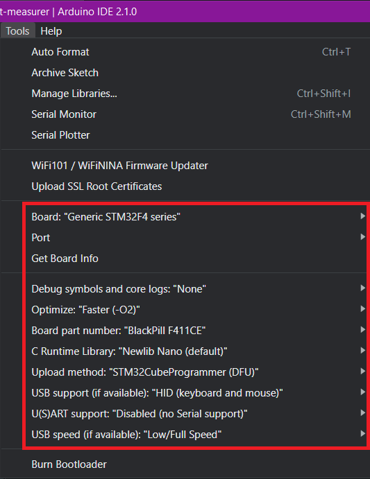
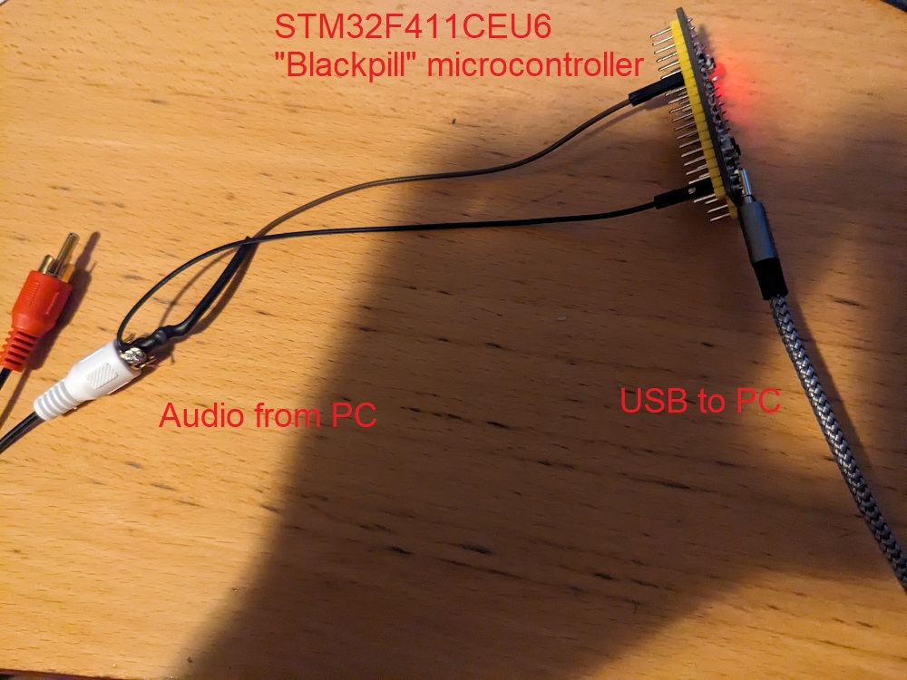
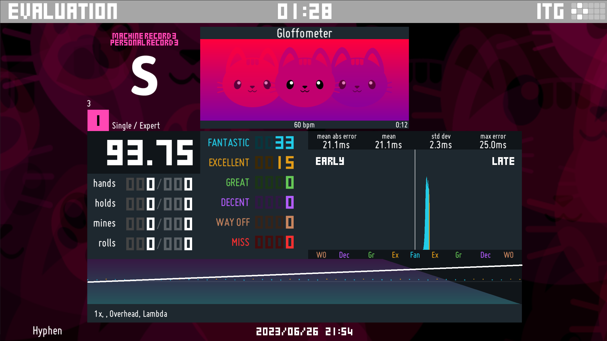

This is a tool for measuring your audio + input latency in the game Stepmania (or similar games), to determine what your "global offset" should be, in an objective way that doesn't depend on your personal skill at timing your inputs. You hook it up to your computer audio and USB and it sends a keypress when it detects a sound.

It's an arduino sketch built for an STM32F411CEU6 "Blackpill" microcontroller, currently available on AliExpress for under $4: https://www.aliexpress.us/item/3256801269871873.html

You might be able to use a different microcontroller but you'd likely need to change some code.

Usage:

1: Install the Arduino IDE: https://www.arduino.cc/en/software

2: Set up STM32duino: https://github.com/stm32duino/Arduino_Core_STM32/wiki/Getting-Started

(You will need STM32CubeProgrammer as mentioned in the above link)

3: Configure like so: 

4: Plug the board in via USB, and put it in DFU mode by holding BOOT0, tapping NRST, and then releasing BOOT0.

5: Click the "Upload" button in the project in the Arduino IDE. It should display a bunch of STM32CubeProgrammer output ending with "Start operation achieved successfully". The LED on the device should flash 4 times quickly if it worked.

6: Connect an audio cable from your computer to the board. The ground wire goes to G and the signal wire goes to pin A1. (left or right channel doesn't matter.) It should look something like this: 

7: Copy the "test pack" folder to your Stepmania Songs/ directory. It contains a song called "Gloffometer", which is just a bunch of clicks. 

8: When the song audio is going to the board, the LED should blink in time with the clicks. If it's blinking too much or not enough, you might need to adjust the "threshold" value in the code.

9: Bind the "a" key on your keyboard to the left arrow in Stepmania. 

10: Play the song. When it's in the process of starting, hit the "KEY" button on the board to enable sending keypresses. After the song is done you can press KEY again to toggle it back off, so you don't get a bunch of "a" keypress spam when you don't want it happening. The LED blinks once when you enable keypresses, and twice when you disable them.

11: It should hit all the arrows in the song. Check your mean error on the results screen to see how good your global offset is. If your mean error is positive, reduce your offset, and vice versa. Gloffometer is a 9ms offset chart (the ITG standard), so if you want to play null-offset charts, you'll need to change the value by an additional 9ms. Here's what it looks like for me when my global offset is set to 0. This indicates that I should set my offset to -21ms

12: If you play the game using speakers that send the sound into the room, rather than with headphones, you'll want to account for the speed of sound in your offset. That's about 1100 feet per second, so measure how many feet it is from the speakers to your ears, and subtract 1.1ms per foot.

That's it!

Shoutouts to CardboardBox and JNero who have a similar project and whose Gloffometer test chart I'm using.
